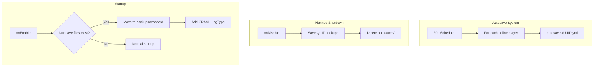

# InventoryRestore Full Refactor Plan

## Summary of Changes

| Area | Changes |
|------|---------|
| **Rename** | InventoryRollbackPlus -> InventoryRestore (all identifiers, packages, configs, permissions) |
| **Autosave** | Every 30 seconds save all online players to temp folder |
| **Shutdown** | On planned disable, delete autosave temp files |
| **Crash Detection** | On startup, if temp files exist -> move to crashes, add CRASH LogType |
| **Offline Restore** | Write inventory/ender/xp/hunger to player.dat via NBT |
| **Overwrite Warning** | New confirmation GUI with live-updating current inventory before restore |
| **Health** | Remove health restore entirely |

---

## Phase 1: Rename to InventoryRestore

### 1.1 Build and Identity
- **pom.xml**: Change `artifactId`, `name` to `InventoryRestore`; update `description`, `url`
- **plugin.yml**: Change plugin name, main class reference, command `inventoryrollbackplus` -> `inventoryrestore` (aliases: `ir`, `irp`), all permissions `inventoryrollbackplus.*` -> `inventoryrestore.*`
- **META-INF/**: Update any manifest references

### 1.2 Package and Class Renames
- Rename legacy package roots to `com.notauthorised.inventoryrestore`
- Rename `InventoryRollbackPlus.java` -> `InventoryRestore.java`
- Update all imports and references (Commands, ConfigData, MessageData, etc.)

### 1.3 Config and Messages
- **config.yml**: Add `autosave-interval-seconds: 30`, `autosave-enabled: true`
- **messages.yml**: Rename prefix to InventoryRestore; remove health-related messages; add overwrite-warning, crash, offline-restore messages
- Update ConfigData, MessageData to use new keys

### 1.4 Permission Migration
- plugin.yml: New permission tree `inventoryrestore.*`; add legacy `inventoryrollbackplus.*` mapping for compatibility
- Grep all `inventoryrollbackplus.` usages and replace with `inventoryrestore.`

---

## Phase 2: 5-Second Autosave and Crash Handling

### 2.1 Autosave Storage
- New folder: `backups/autosaves/{uuid}.yml` - one file per player, overwritten each 30s
- Same YAML format as existing backups

### 2.2 Autosave Scheduler
- In main plugin: On enable, schedule repeating task every 30 seconds (600 ticks)
- For each online player: save snapshot to autosave folder
- Create `AutoSaveManager` class or extend SaveInventory logic

### 2.3 YAML for Autosaves
- **YAML.java**: Add `createAutosaveFolder()`, `getAutosavePath(uuid)`, `saveAutosave()`, `getAllAutosaveFiles()`, `deleteAutosaveFolder()`, `moveAutosaveToCrash(uuid)`
- In `createStorageFolders()`: add `autosaves/` and `crashes/` folders

### 2.4 Shutdown: Delete Autosaves
- In `onDisable()`: after saving QUIT, delete entire `autosaves/` folder contents

### 2.5 Startup: Crash Detection
- In `onEnable()`: check if `autosaves/` has files
- If yes: move each to `backups/crashes/{uuid}/{timestamp}.yml`
- Add `LogType.CRASH`
- **LogType.java**: Add `CRASH`
- **YAML.java**: Add `crashes/` in `getBackupFolderForLogType`
- **PlayerMenu.java**: Add crash button next to world change (slot 7)
- **Buttons.java**: Add `createCrashLogButton`

---

## Phase 3: Offline Player Restore

### 3.1 Player.dat NBT Editing
- Player data: `{world}/playerdata/{uuid}.dat` (NBT format)
- Write: `Inventory`, `EnderChestItems`, `foodLevel`, `foodSaturation`, XP fields
- Do NOT write `Health`
- Add NBT dependency: Item-NBT-API (tr7zw) or similar
- Create `OfflinePlayerDataEditor` utility

### 3.2 Restore Flow for Offline
- In ClickGUI: When restore clicked and `!offlinePlayer.isOnline()` -> call `OfflinePlayerDataEditor.applyBackupToOfflinePlayer()`
- Apply: main inv, ender chest, XP, hunger (no health)

### 3.3 MySQL
- Crashes/autosaves: file-only (no MySQL) for simplicity

---

## Phase 4: Overwrite Warning GUI

### 4.1 New Menu: OverwriteWarningMenu
- Triggered when staff clicks "Restore All"
- Layout: Top 4 rows = target's current inventory (live), Row 5 = warning, Row 6 = [Back] [Confirm Rollback]
- "Back" -> return to MainInventoryBackupMenu
- "Confirm Rollback" -> execute restore (inv + ender + xp + hunger)

### 4.2 Live Inventory Updates
- BukkitRunnable every second: refresh top inventory with `target.getInventory().getContents()` if online
- If offline: show "Player offline - restore writes to player data"

### 4.3 Flow
- `restoreAllInventory` -> open OverwriteWarningMenu
- OverwriteWarningMenu "Confirm" -> perform restore
- Add `InventoryName.OVERWRITE_WARNING`, handle in ClickGUI

---

## Phase 5: Remove Health Restore

### 5.1 GUI
- **MainInventoryBackupMenu.java**: Remove slot 51 (health button)
- **Buttons.java**: Remove `healthButton`, `getHealthIcon`
- Shift: Hunger 51, XP 52

### 5.2 Click Handler
- **ClickGUI.java**: Remove block for health icon (~lines 510-532)
- Restore All never touches health

### 5.3 Messages
- **messages.yml**: Remove `attribute-restore.health`
- **MessageData.java**: Remove health-related getters

### 5.4 Data
- Keep storing health in backups (for display) - only remove restore

---

## Architecture Diagram

---

## File Change Summary

| File | Action |
|------|--------|
| pom.xml | Rename artifact, add NBT-API dep |
| plugin.yml | Rename plugin, commands, permissions |
| InventoryRollbackPlus.java -> InventoryRestore.java | Rename, add autosave + startup crash check |
| LogType.java | Add CRASH |
| YAML.java | Add autosave/crash folders and methods |
| PlayerMenu.java | Add CRASH button |
| Buttons.java | Add crash button, remove health button |
| MainInventoryBackupMenu.java | Remove health slot, wire restore to warning |
| ClickGUI.java | Remove health handler, add OverwriteWarning handler, offline restore |
| New: AutoSaveManager.java | 30s scheduler, save to autosaves/ |
| New: OfflinePlayerDataEditor.java | NBT edit player.dat for offline restore |
| New: OverwriteWarningMenu.java | Warning GUI with live inventory |
| config.yml | autosave-interval, autosave-enabled |
| messages.yml | Remove health, add overwrite/crash/offline |
| ConfigData.java, MessageData.java | New keys, remove health |

---

## Dependencies
- Add **Item-NBT-API** (tr7zw) for player.dat read/write - check 1.20.5 compatibility
- Alternative: NMS reflection for entity save (more complex)

---

## Testing Checklist
- [ ] Rename: Plugin loads as InventoryRestore
- [ ] Autosave: Files in autosaves/ every 30s
- [ ] Shutdown: autosaves/ empty after stop
- [ ] Crash: Kill server, restart -> crashes/ populated, CRASH button works
- [ ] Offline restore: Restore offline player, login -> inventory matches
- [ ] Overwrite warning: Restore -> warning -> live inv -> confirm
- [ ] Health: No health button, no health in restore
